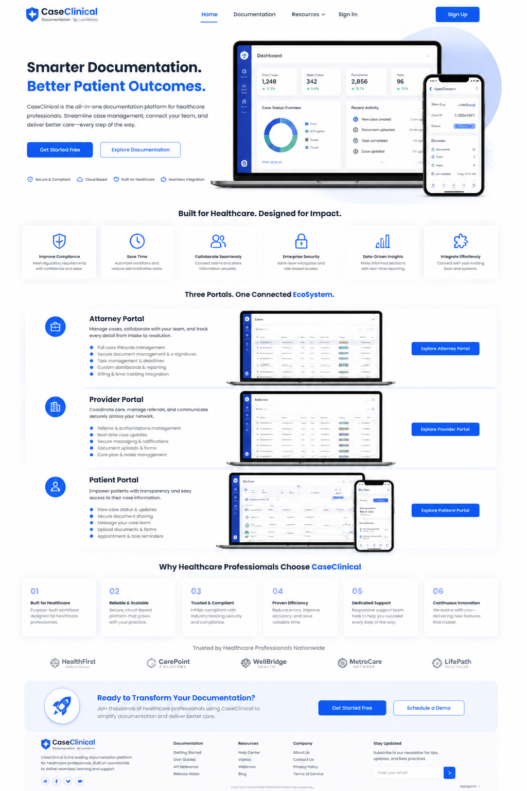
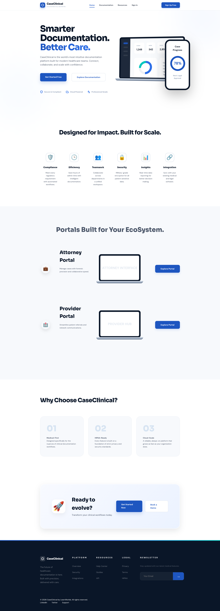

#  CaseClinical

<p align="center">
  
</p>

<p align="center">
  <a href="#-features">Features</a> •
  <a href="#-showcase">Showcase</a> •
  <a href="#-tech-stack">Tech Stack</a> •
  <a href="#-getting-started">Getting Started</a>
</p>

<p align="center">
  
  
  
</p>

---

### 🩺 About the Project

**CaseClinical** is a premium collection of medical-grade landing page designs and UI replicas. Focused on high-performance, accessible, and visually stunning documentation tools for the modern healthcare era.

> "Bridging the gap between clinical precision and modern design aesthetics."

---

### ✨ Features

- 🚀 **Ultra-Responsive:** Pixel-perfect layouts for mobile, tablet, and desktop.
- 🎨 **Modern Aesthetics:** Leveraging Sora & DM Sans typography for a clinical yet friendly feel.
- ⚡ **Optimized Performance:** Lightweight HTML/CSS without the bloat.
- 🧪 **Component-Based:** Modular CSS variables for rapid theme switching.
- 🪄 **Micro-Animations:** Smooth transitions and hover effects using CSS cubic-beziers.

---

### 🖼️ Showcase

| Design Variant | Preview |
| :--- | :--- |
| **Main Landing** |  |
| **Search Experience** |  |
| **Data Output** |  |

---

### 🛠️ Tech Stack

<p align="left">
  
  
  
  
</p>

---

### 🚀 Getting Started

1. **Clone the repository**
   ```bash
   git clone https://github.com/traximuser23/learningCurve.git
   ```

2. **Install dependencies**
   ```bash
   npm install
   ```

3. **Format code**
   ```bash
   npm run format
   ```

4. **Launch**
   Open `homepahe.html` in your favorite browser to begin.

---

### 📬 Let's Connect

<p align="left">
  <a href="https://github.com/traximuser23">
    
  </a>
</p>

<p align="center">
  Built with ❤️ by <a href="https://github.com/traximuser23">Shoaib Malik</a>
</p>

<p align="center">
  
</p>
